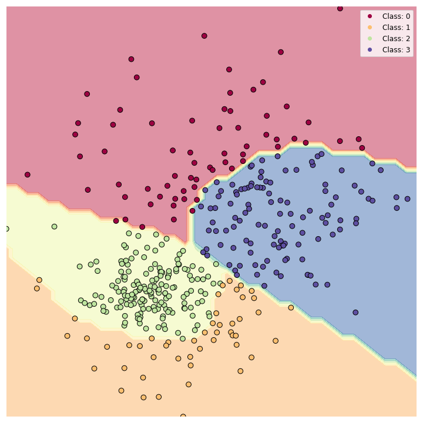
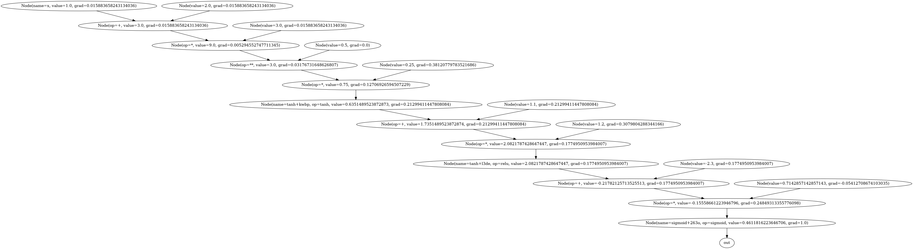
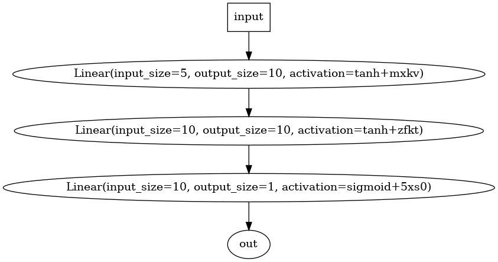

# MuTorch: A lightweight Deep Learning framework with PyTorch-like API
[**GitHub**](https://github.com/towardsautonomy/mutorch)

MuTorch is a deep learning framework built for educational purposes and building a deep understanding of how neural networks work. This is not intended to be efficient, but rather very simplistic. The goal is to build a framework that is easy to understand, modify, and learn from. **It does not use any external libraries, and is built from scratch using only Python lists and operators**.

Some of the nomenclature used in this framework is inspired by PyTorch and are defined below:

 - **Node**: A node is the most basic unit of the computational graph and represents either a value or an operation.  
 - **Neuron**: A neuron is a collection of node which represents a single unit of the neural network. It uses a stack of *nodes* to compute **Wx + b** and then applies an activation function to the result.  
 - **Tensor**: A tensor is a collection of *nodes* and can be multi-dimensional. It is used to represent the input and output of a neuron.  
 - **Layer**: A layer performs computations on a tensor and returns a tensor.  

The framework is built in a modular way, and can be extended to include new layers, activation functions, and optimizers. Examples of how to use the framework to build *node-level*, *tensor-level*, or a full fledged *Sequential MLP* are provided in the [Demo Notebook]([demo.ipynb](https://github.com/towardsautonomy/mutorch/blob/main/demo.ipynb)) notebook. *Loss functions* and *optimizer implementations* are also provided to build an end-to-end understanding of neural network training process. The framework also provides a simple way to visualize the computational graph using [Graphviz](https://graphviz.org/).



## Building a Neural Network

The framework can be used in a few ways:

### 1. Node-level: The framework can be used to build a single node and then use it to build a computational graph. 

 ```python
    from mutorch import Node
    from mutorch import nn

    # define a node and perform some operations
    x = Node(1, name='x', requires_grad=True)
    x = x + 2
    x = x * 3
    x = x ** 0.5
    x = x / 4
    x = nn.Tanh()(x)
    y = (x + 1.1) * 1.2
    x = nn.ReLU()(y)
    x = (x - 2.3) / 1.4
    x = nn.Sigmoid()(x)
    # perform a backward pass
    x.backward()
 ``` 
 

### 2. Tensor-level: An example of tensor-level operation is shown below:

 ```python
    import mutorch
    from mutorch import nn

    # define tensors and perform some operations
    x = mutorch.Tensor([[1,2,3,4,5],
                        [2,3,4,5,6]])
    w = mutorch.Tensor([[1.0, 1.1, 1.2, 1.3, 1.4], 
                        [2.0, 2.1, 2.2, 2.3, 2.4]])
    bias = mutorch.Tensor([[1.0, 2.0, 3.0, 4.0, 5.0],
                        [2.0, 3.0, 4.0, 5.0, 6.0]])  
    z = ( x * w ) + bias
    z = z / 2.2
    z = nn.Tanh()(z)
    # perform backward pass
    z.backward()
 ```

### 3. Sequential MLP: The framework can be used to build a complete neural network through sequential layers. An example is shown below:

 ```python
    from mutorch import nn

    # define a sequential neural network with non-linear activation
    model = nn.Sequential(
                nn.Linear( input_size=5, output_size=10, activation=nn.Tanh() ),
                nn.Linear( input_size=10, output_size=10, activation=nn.ReLU() ),
                nn.Linear( input_size=10, output_size=1, activation=nn.Sigmoid() )
            )
    # define an example input tensor with batch size 2
    x = [[1,2,3,4,5], [2,3,4,5,6]]
    # perform a forward pass
    y = model( x )
    # perform a backward pass
    y.backward()
 ```
  

## Optimizers

The framework provides a simple way to build optimizers and use them during the neural network training process. Few examples of optimizers provided within the framework include SGD, Adam, etc. 

 ```python
    # example of defining an Adam optimizer
    from mutorch import optim
    optimizer = optim.Adam(model.parameters(), lr=0.01)
 ```

## Loss Functions

Loss functions can be easily built using the MuTorch framework. Few example losses implemented within the framework include MSE, L1, SmoothL1, etc.

 ```python
    # example of defining an MSE loss
    from mutorch import losses
    loss_fn = losses.MSELoss()
 ```

## Training a Neural Network

Putting it all together, the framework can be used to build a complete neural network and train it using a loss function and an optimizer. An example is shown below:

 ```python
    import mutorch
    from mutorch import nn, losses, optim

    # input tensor
    x = mutorch.Tensor([[0.6, -0.35,  0.47,  0.71,  0.12],
                        [0.3,  0.45, -0.67, -0.89,  0.23],
                        [0.5,  0.65,  0.87,  0.99,  0.34],
                        [0.7, -0.85,  0.97, -0.11,  0.45],
                        [0.9, -0.01, -0.13,  0.25, -0.56],
                        [-0.2, 0.32, -0.54,  0.76,  0.98]])
    # ground truth
    y = mutorch.Tensor([[0.0], 
                        [0.0], 
                        [0.0], 
                        [1.0], 
                        [1.0], 
                        [1.0]])
    # define a sequential neural network with non-linear activation
    model = nn.Sequential(
                nn.Linear( input_size=5, output_size=10, activation=nn.Tanh() ),
                nn.Linear( input_size=10, output_size=10, activation=nn.ReLU() ),
                nn.Linear( input_size=10, output_size=1, activation=nn.Sigmoid() )
        )
    # define an optimizer and loss function
    optimizer = optim.Adam(model.parameters(), lr=0.01)
    loss_fn = losses.MSELoss()
    # perform 500 epochs of training
    for epoch in range(500):
        # reset the gradients
        optimizer.zero_grad()
        # perform a forward pass
        y_pred = model(x)
        # compute the loss
        loss = loss_fn(y_pred, y)
        # perform a backward pass
        loss.backward()
        # update the parameters
        optimizer.step()
 ```

```
Ground truth:  [0.0, 0.0, 0.0, 1.0, 1.0, 1.0]
Model output before training:  [0.2625455157756882, 0.06476329944788511, 0.09198898000403521, 0.13625100888110614, 0.3455240473051357, 0.04765093283946377]
#################### Starting model training...
Epoch 500/500 - Loss: 0.000075: 100% ||||||||||||||||||||||||| [00:07<00:00, 69.41it/s]
#################### Training complete!
Model output after training:  [0.012926827557352217, 0.008991985611204682, 0.0027829626242188233, 0.9912839449884999, 0.9925483053096971, 0.9921878687511471]
```

Model weights can further be saved and loaded using `model.save(filename)` and `model.load(filename)` respectively.

This was just a toy example, but it can easily be extended to a more realistic problem such as classification. One can also further dissect the model to visualize the decision boundary as shown in the figure above. 

**For a better understanding of the framework, examples on how to train models for realistic problems, please see the [Demo Notebook](https://github.com/towardsautonomy/mutorch/blob/main/demo.ipynb).**
